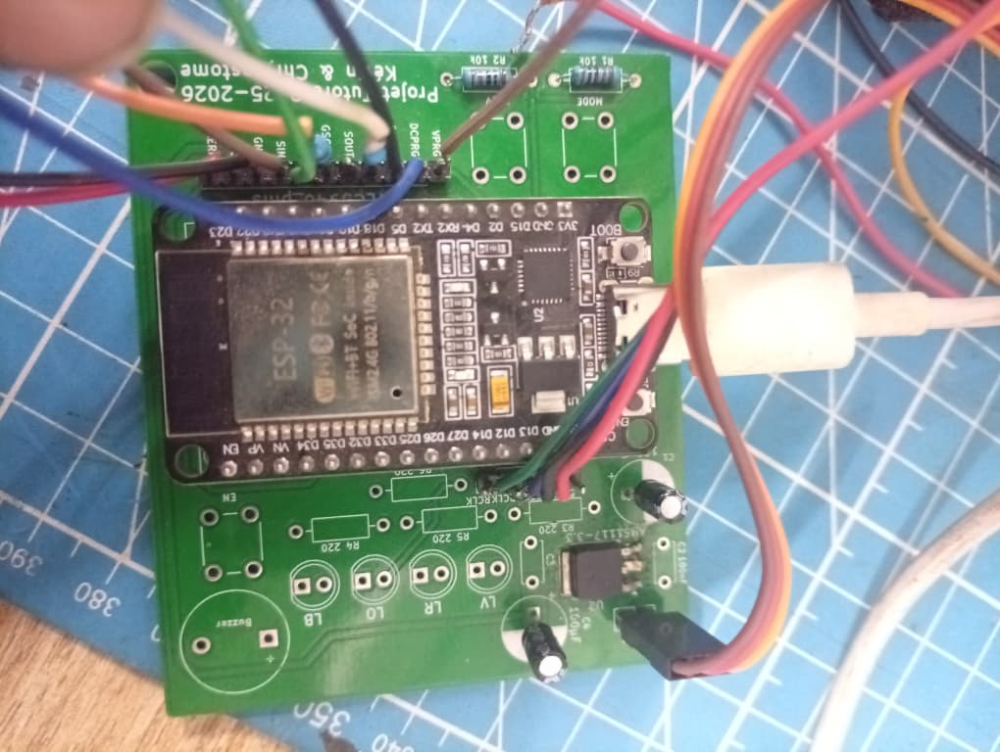
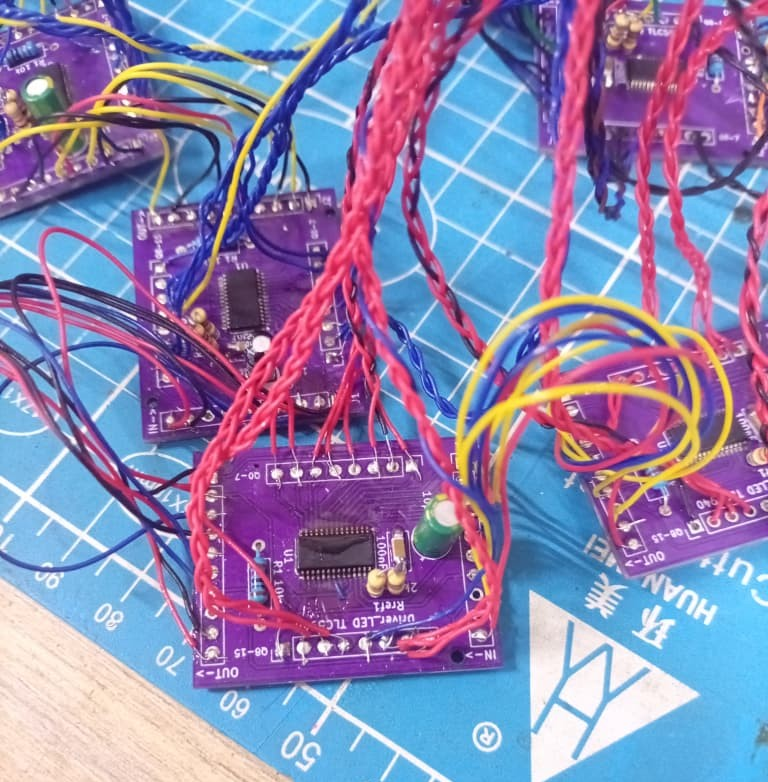
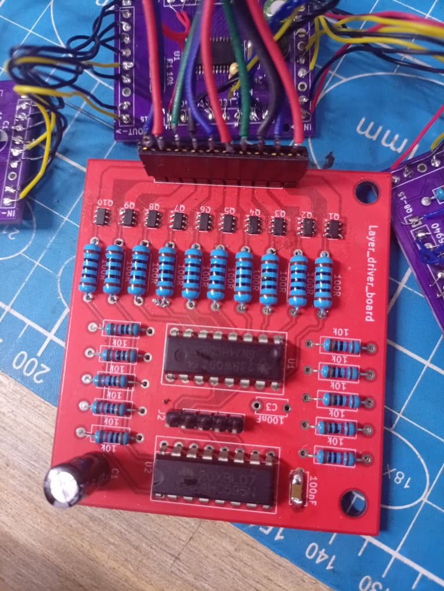
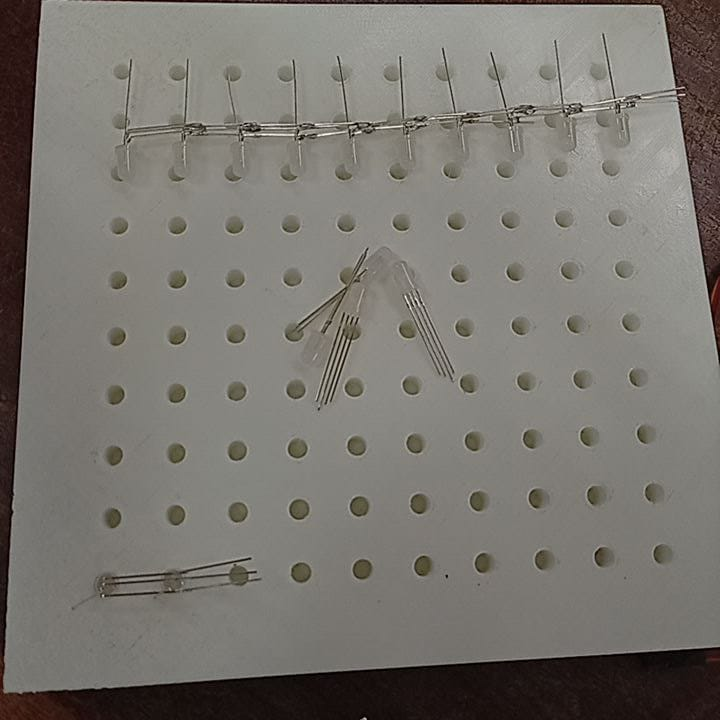
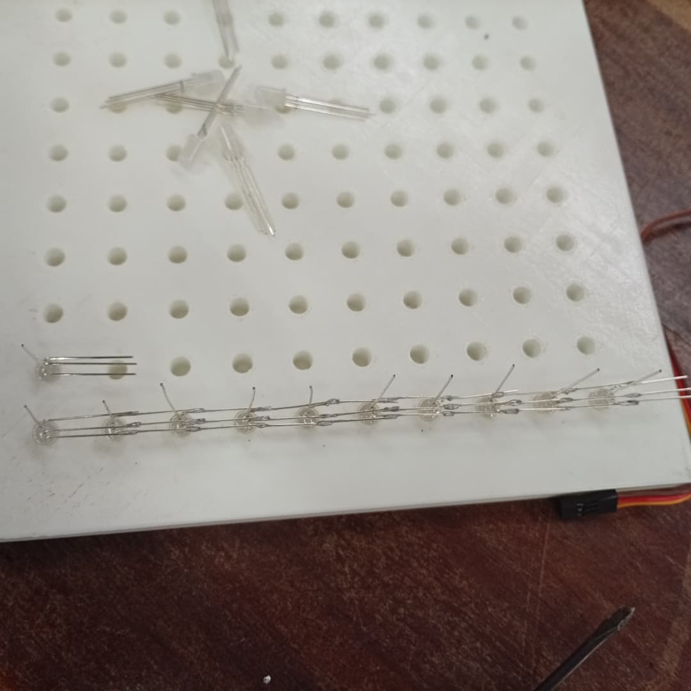
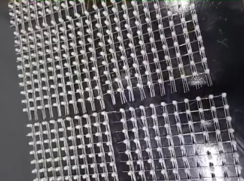
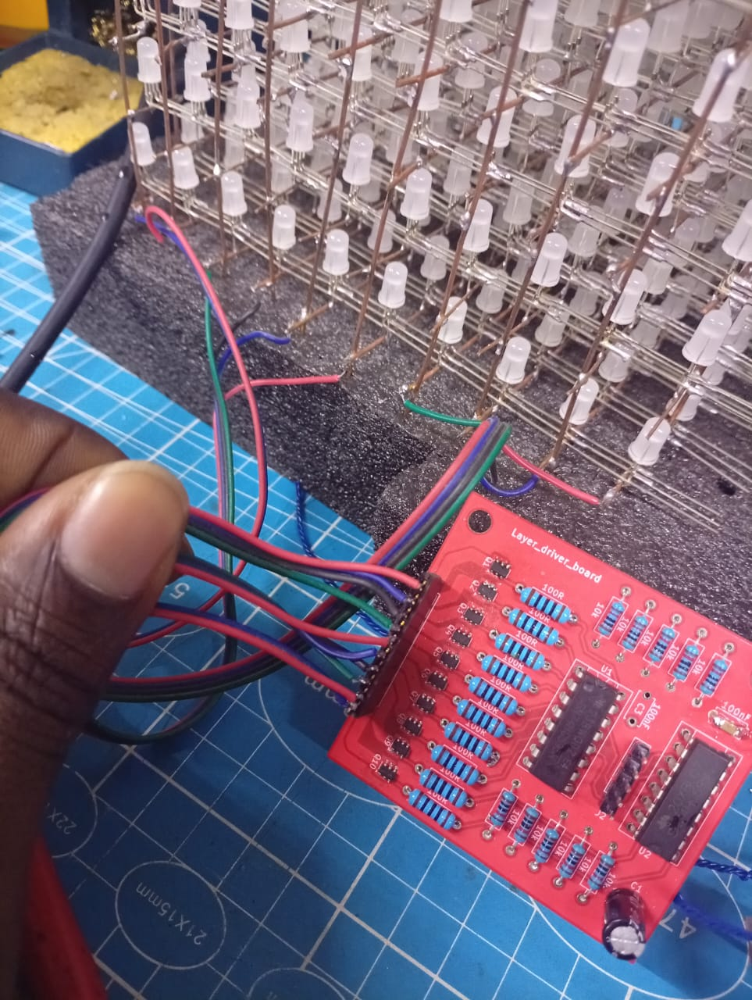

# Réalisation & Assemblage

Cette section documente toutes les étapes de fabrication physique du cube O'Matrix : soudure des composants sur les PCBs, assemblage de la matrice LED et connexion aux drivers TLC5940.

---

## 1. Soudure des composants sur les PCBs

### 1.1 Carte principale (Main Board)

La carte principale embarque l'ESP32, le régulateur AMS1117-3.3, le connecteur vers les drivers TLC5940 et les connecteurs vers le driver des plans.

**Ordre de soudure recommandé :**

1. Composants CMS (condensateurs 100 nF, résistances) en premier
2. Régulateur AMS1117-3.3
3. Connecteurs à broches (TLC5940_PINS, 74HC595_PINS)
4. Boutons MODE et PREV
5. LED de signalisation
6. ESP32-DEVKIT-V1 en dernier (composant le plus haut)

<figure markdown>
  { width=700 }
  <figcaption>Carte principale après soudure de quelques composants</figcaption>
</figure>

---

### 1.2 Cartes Driver TLC5940

Chaque carte TLC5940 reçoit un seul circuit intégré TLC5940NT avec sa résistance Rref et ses condensateurs de découplage.

**Composants par carte :**

| Composant | Valeur | Position |
|-----------|--------|----------|
| TLC5940NT | — | U1 |
| Rref | 2 kΩ | R1 |
| Condensateur découplage | 100 nF | C1 |
| Condensateur électrolytique | 10 µF | C2 |
| Résistance XERR | 10 kΩ | R2 |
| Connecteur IN | 10 broches | J1 |
| Connecteur OUT | 10 broches | J2 |
| Connecteur LEDS | 16 broches | J3, J4 |

!!! warning "Orientation du TLC5940"
    Vérifier le repère de broche 1 (encoche ou point) avant de souder. Un TLC5940 mal orienté sera détruit à la mise sous tension.

<figure markdown>
  { width=640 height=480 }
  <figcaption>Carte driver TLC5940 après soudure — vue recto</figcaption>
</figure>

---

### 1.3 Carte Driver Plans (74HC595 + MOSFET)

Cette carte assure la sélection séquentielle des 10 plans via les MOSFET P-canal.

**Composants :**

| Composant | Valeur | Quantité |
|-----------|--------|----------|
| 74HC595 | SOP-16 | 2 |
| MOSFET P-canal | SQ3465EV | 10 |
| Résistance grille | 10 kΩ | 10 |
| Résistance pull-up | 100 Ω | 10 |
| Condensateur | 100 nF | 2 |
| Condensateur électrolytique | 10 µF | 1 |

<figure markdown>
  { width=640 height=480 }
  <figcaption>Carte driver des plans (74HC595 + MOSFET) après soudure</figcaption>
</figure>

---

## 2. Assemblage de la Matrice LED

### 2.1 Structure mécanique

La base de la matrice a été modélisée sous **Autodesk Fusion 360** — une plaque percée de **100 trous régulièrement espacés** (pas de 10 mm) pour maintenir les LEDs en position verticale pendant la soudure.

<figure markdown>
  { width=640 height=480 }
  <figcaption>Base percée de 100 trous — maintien des LEDs pendant l'assemblage</figcaption>
</figure>

---

### 2.2 Formation des plans d'anodes communes

Chaque **plan** correspond à une rangée de **100 LEDs RGB** dont les cathodes sont soudées ensemble pour former une série d'électrodes R, G et B communes.

**Étapes :**

1. Insérer 10 LEDs dans la base en alignant les cathodes (patte courtes) du même côté
2. Plier toutes les cathoodes vers l'extérieur à 90°
3. Souder les anodes entre elles sur toute la rangée
4. Vérifier la continuité électrique avec un multimètre
5. Répéter pour les 10 lignes 

```
Plan vue de côté :

  LED  LED  LED  LED  LED  LED  LED  LED  LED  LED
   |    |    |    |    |    |    |    |    |    |
   └────┴────┴────┴────┴────┴────┴────┴────┴────┘
              Cathode commune soudée
```

<figure markdown>
  { width=640 height=480 }
  <figcaption> Pliage et soudure des cathodes communes (B, G, R) pour former une ligne de 10 LEDs</figcaption>
</figure>

<figure markdown>
  { width=640 height=480 }
  <figcaption>Un plan de 10 LEDs avec anode commune — prêt à être empilé</figcaption>
</figure>

---

### 2.3 Empilement des 10 plans (couches)

Les 10 plans sont empilés verticalement avec un espacement régulier de **10 mm** entre chaque couche.

**Points critiques :**

- Maintenir l'alignement vertical des colonnes pendant la soudure
- Ne pas court-circuiter les cathodes de deux couches adjacentes
- Laisser suffisamment de longueur sur les cathodes pour le câblage vers les TLC5940

<figure markdown>
  .jpg){ width=640 height=480 }
  <figcaption>Les 10 plans empilés — vue de face des anodes communes  à chaque plan</figcaption>
</figure>

<figure markdown>
  .jpg){ width=640 height=480 }
  <figcaption>Cube O'Matrix — 1 000 LEDs RGB assemblées en matrice 10×10×10</figcaption>
</figure>

---

## 3. Connexion des Cathodes aux Drivers TLC5940

### 3.1 Principe de câblage

Chaque LED RGB a **3 cathodes** (R, G, B). Pour une couche de 10 LEDs, cela fait **30 cathodes** à connecter aux sorties des TLC5940.

La chaîne de 19 TLC5940 est continue :

```
Couche 0  →  TLC1 (OUT0-OUT7) + TLC2 (OUT8-OUT15) → 30 canaux (10 LEDs × 3)
Couche 1  →  TLC2 (reste)    + TLC3               → 30 canaux
...
Couche 9  →  TLC18 + TLC19                         → 30 canaux
                                        (4 canaux inutilisés sur TLC19)
```

### 3.2 Ordre de connexion B-G-R

!!! danger "Ordre câblage obligatoire : B → G → R"
    Les cathodes sont connectées dans l'ordre **Bleu, Vert, Rouge** sur chaque sortie TLC5940. Cet ordre est imposé par le PCB et doit être strictement respecté. Une inversion produira des couleurs incorrectes.

```
Pour chaque LED (couche y, colonne x) :
  Canal TLC = y × 30 + x × 3

  Canal + 0  →  Cathode Bleue  (B)
  Canal + 1  →  Cathode Verte  (G)
  Canal + 2  →  Cathode Rouge  (R)
```

### 3.3 Tableau de câblage couche par couche

| Couche | LEDs | Canaux TLC | TLC concernés |
|--------|------|-----------|---------------|
| 0 | 0–9 | 0–29 | TLC1 + TLC2 (partial) |
| 1 | 10–19 | 30–59 | TLC2 (reste) + TLC3 + TLC4 (partial) |
| 2 | 20–29 | 60–89 | TLC4 (reste) + TLC5 + TLC6 (partial) |
| 3 | 30–39 | 90–119 | TLC6 (reste) + TLC7 + TLC8 (partial) |
| 4 | 40–49 | 120–149 | TLC8 (reste) + TLC9 + TLC10 (partial) |
| 5 | 50–59 | 150–179 | TLC10 (reste) + TLC11 + TLC12 (partial) |
| 6 | 60–69 | 180–209 | TLC12 (reste) + TLC13 + TLC14 (partial) |
| 7 | 70–79 | 210–239 | TLC14 (reste) + TLC15 + TLC16 (partial) |
| 8 | 80–89 | 240–269 | TLC16 (reste) + TLC17 + TLC18 (partial) |
| 9 | 90–99 | 270–299 | TLC18 (reste) + TLC19 |

<figure markdown>
  .jpg){ width=640 height=480 }
  <figcaption>Connexion des cathodes RGB vers les sorties des cartes TLC5940</figcaption>
</figure>

---

### 3.4 Connexion des anodes aux MOSFET

Chaque plan d'anode commune est connecté au drain d'un MOSFET P-canal (SQ3465EV) sur la carte driver des plans.

```
Plan 0 (couche basse)   → MOSFET Q0 → +5V
Plan 1                  → MOSFET Q1 → +5V
...
Plan 9 (couche haute)   → MOSFET Q9 → +5V

74HC595 sortie Qn = LOW  → MOSFET passant → Plan ACTIF
74HC595 sortie Qn = HIGH → MOSFET bloqué  → Plan ÉTEINT
```

<figure markdown>
  { width=640 height=480 }
  <figcaption>Connexion des anodes communes de chaque plan vers les MOSFET P-canal</figcaption>
</figure>

---

## 4. Résultat final

<figure>
  <a href="../assets/images/cube_final.jpg" target="_blank">
    
  </a>
  <figcaption style="text-align:center; font-size:0.85em; color:#888; margin-top:0.5rem">
   
  </figcaption>
</figure>

<figure markdown>
  { width=640 height=480 }
  <figcaption> O'Matrix — Cube LED RGB 10×10×10 en fonctionnement</figcaption>
</figure>

!!! success "Checklist avant mise sous tension"
    - [ ] Toutes les anodes communes connectées aux bons MOSFET
    - [ ] Ordre B-G-R respecté sur chaque carte TLC5940
    - [ ] Aucun court-circuit entre cathodes de couches adjacentes
    - [ ] Condensateurs de découplage soudés sur chaque carte TLC
    - [ ] GND commun entre ESP32, cartes TLC et alimentation 5V
    - [ ] Tension d'alimentation vérifiée à 5 V avant connexion des LEDs
