# Conception des PCBs

## Vue d'ensemble

Trois cartes électroniques ont été conçues sous **KiCad** et fabriquées par **JLCPCB** :

| Carte | Référence | Quantité | Contenu |
|-------|-----------|----------|---------|
| Carte principale | `Gerber_Main_Board_Y2` | 5 | ESP32, AMS1117-3.3, 74HC595, connecteurs |
| Driver LED TLC5940 | `Gerber_TLC5940_Y3` | 20 | 1× TLC5940, Rref 2kΩ, condensateurs, connecteurs |
| Driver plans | `Gerber_74HC595_Y4` | 5 | 74HC595 × 2, MOSFET × 10, résistances de grille |

---

## Carte principale (Main Board)

Embarque :

- **ESP32-WROOM-32** — microcontrôleur principal
- **AMS1117-3.3** — régulateur 3,3 V pour les circuits logiques
- Connecteur d'alimentation 5 V
- Condensateurs de découplage 100 nF + 10 µF
- Bouton `MODE` — navigation entre modes autonomes
- Bouton `PREV` — sélection de l'animation précédente
- LED de signalisation d'état
- **Connecteur DRIVER_PINS** (vers cartes TLC5940) :
`VPRG, DCPRG, CLK, XLAT, BLANK, GSCLK, SIN, 3V3, GND, XERR`
- **Connecteur 74HC595** (vers la carte du driver des plans 74HC595) :
`RCLK, SRCLK, SER, GND, 5V`

<figure markdown>
  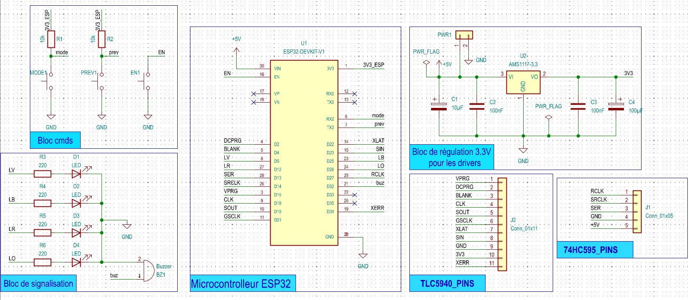{ width=640 height=480 }
  <figcaption>Schematic de la carte principale — cliquer pour agrandir</figcaption>
</figure>

<figure markdown>
  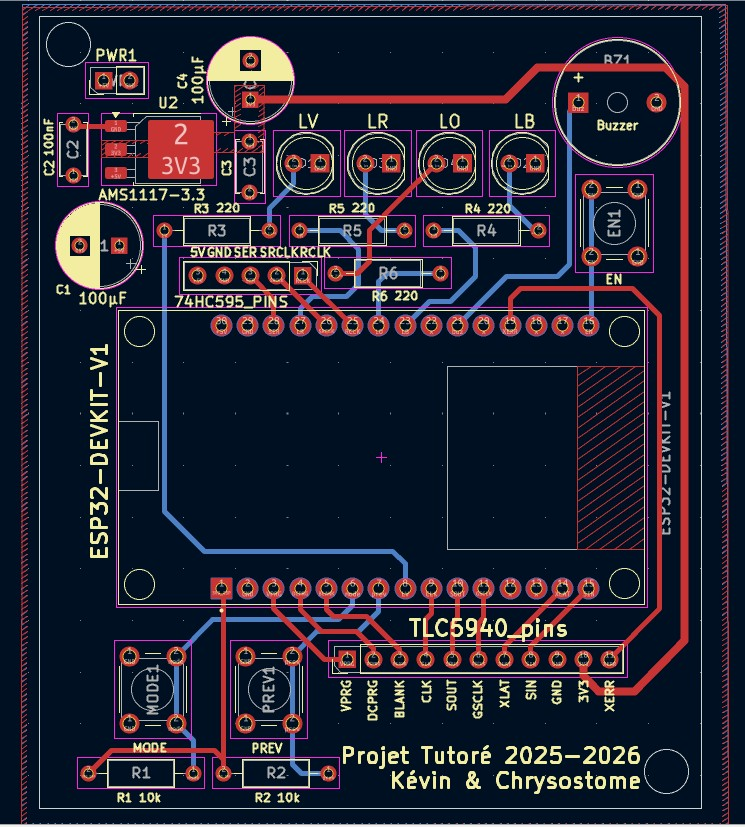{ width=640 height=480 }
  <figcaption>Capture du PCB — cliquer pour agrandir</figcaption>
</figure>

<figure markdown>
  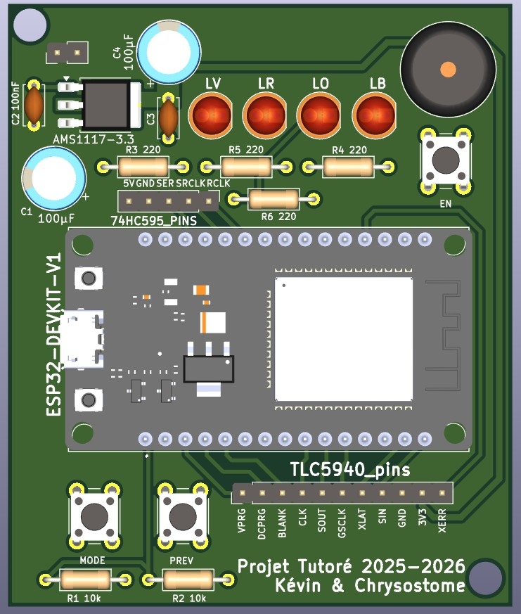{ width=640 height=480 }
  <figcaption>Capture 3D du PCB</figcaption>
</figure>

---

## Carte Driver LED TLC5940

Chaque carte reçoit **un TLC5940** avec :

- Rref = **2 kΩ** → courant max 20 mA par canal
- 2× condensateurs de découplage (100 nF CMS 0402 + 10 µF CMS)
- Résistance XERR 10 kΩ (gestion erreur)
- Connecteurs **IN_PINS** et **OUT_PINS** pour la cascade SPI
- Connecteur **LEDS_PINS** vers les cathodes des LEDs (16 sorties)

La chaîne de 19 cartes est connectée en série : `SOUT` d'une carte → `SIN` de la suivante.

<figure markdown>
  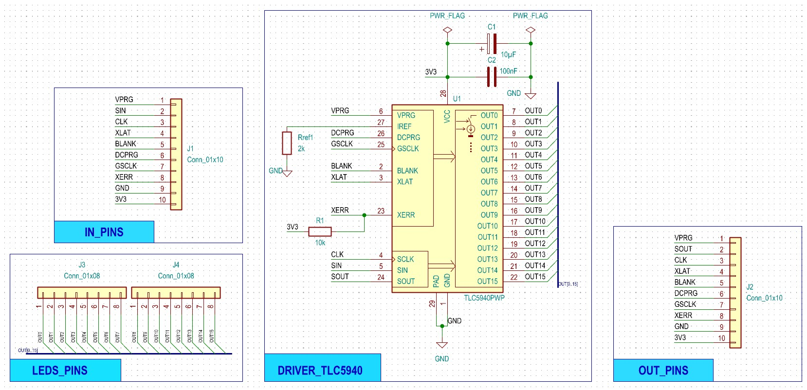{ width=640 height=480 }
  <figcaption> Schéma de montage du TLC5940</figcaption>
</figure>

<figure markdown>
  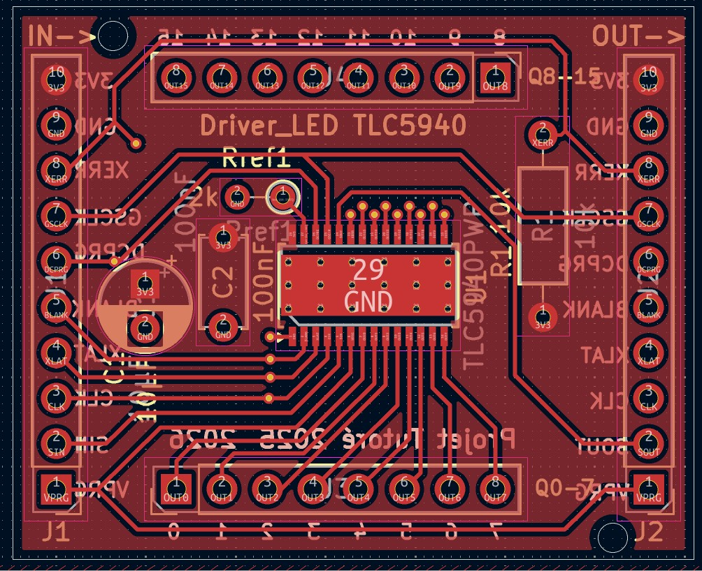{ width=640 height=480 }
  <figcaption> Capture du PCB (front copper)— cliquer pour agrandir</figcaption>
</figure>

<figure markdown>
  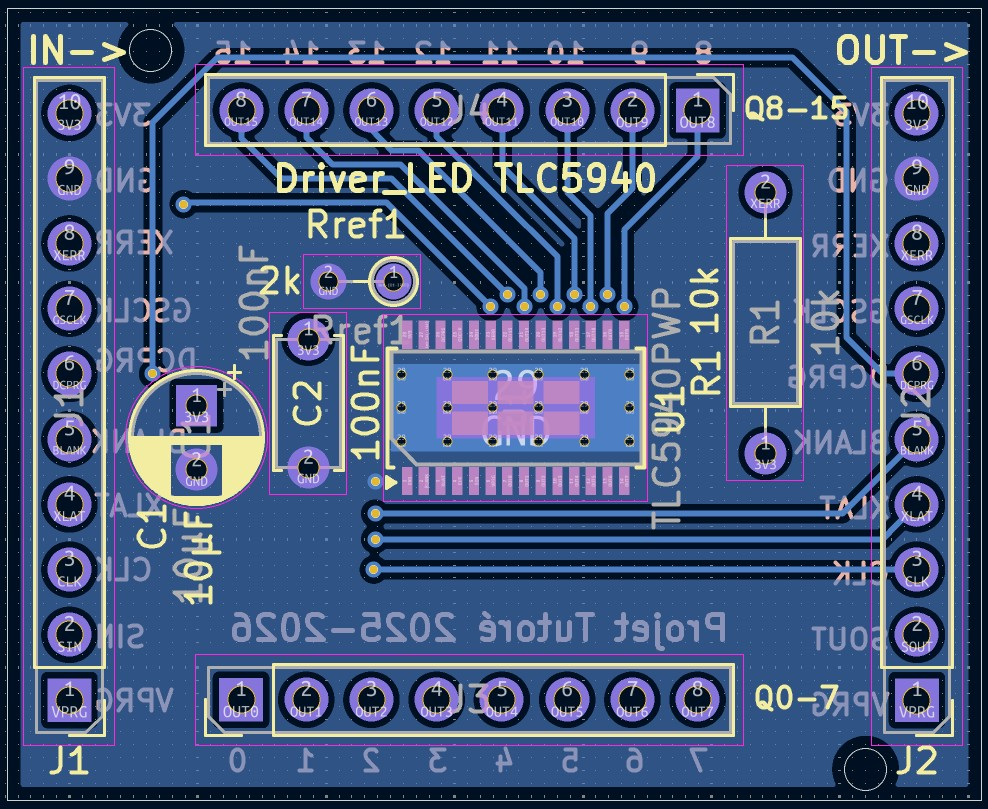{ width=640 height=480 }
  <figcaption>  Capture du PCB (bottom copper)— cliquer pour agrandir</figcaption>
</figure>

<figure markdown>
  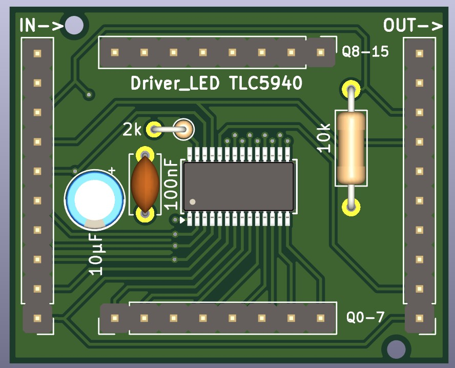{ width=640 height=480 }
  <figcaption>  Capture 3D du PCB</figcaption>
</figure>

---

## Carte Driver Plans (Layer Driver Board)

Intègre :

- **2× 74HC595** en cascade (16 sorties → 10 utilisées)
- **10× MOSFET P-canal SQ3493EV** (ou équivalent IRF9540)
- **10× résistances de grille 100 Ω**
- **10× résistances pull-up 10 kΩ** sur les drains
- Condensateurs de découplage alimentation

**Connecteur IN_PINS** : `RCLK, SER, SRCLK, GND, +5V`

**Connecteur vers anodes** : 10 sorties vers les plans de LEDs

<figure markdown>
  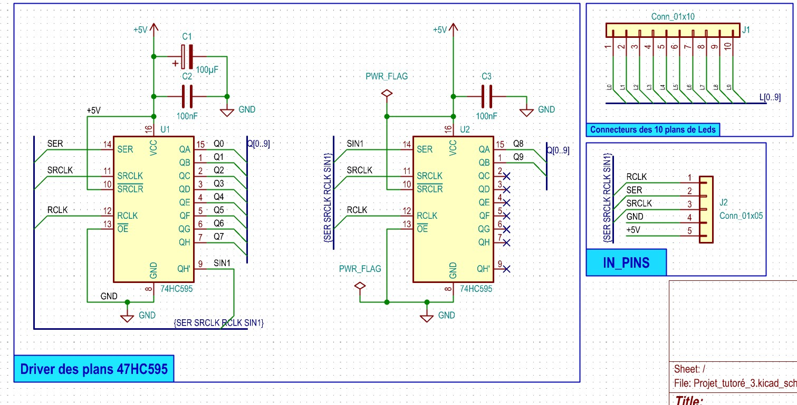{ width=640 height=480 }
  <figcaption>Schematic de la carte de contrôle des plans</figcaption>
</figure>
<figure markdown>
  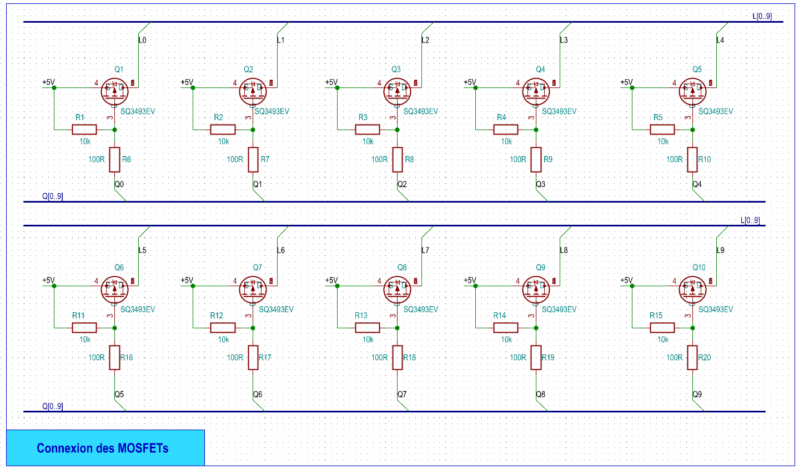{ width=640 height=480 }
  <figcaption>Schéma de montage des mosfets</figcaption>
</figure>

<figure markdown>
  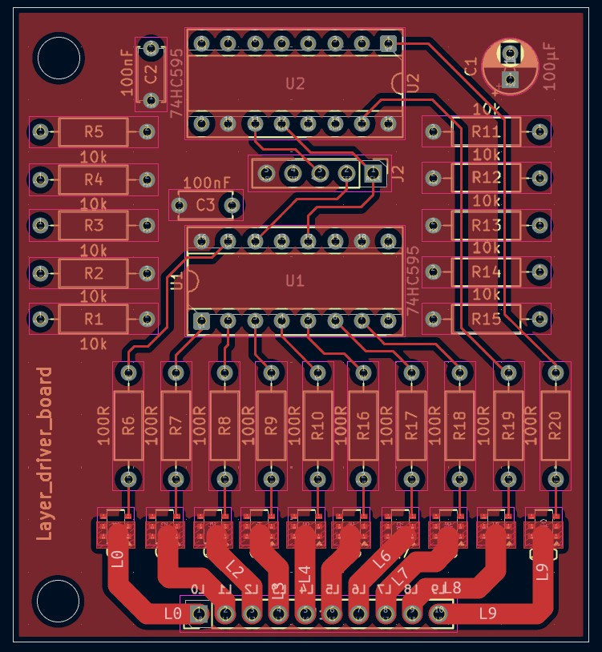{ width=640 height=480 }
  <figcaption> Capture du PCB — cliquer pour agrandir</figcaption>
</figure>

<figure markdown>
  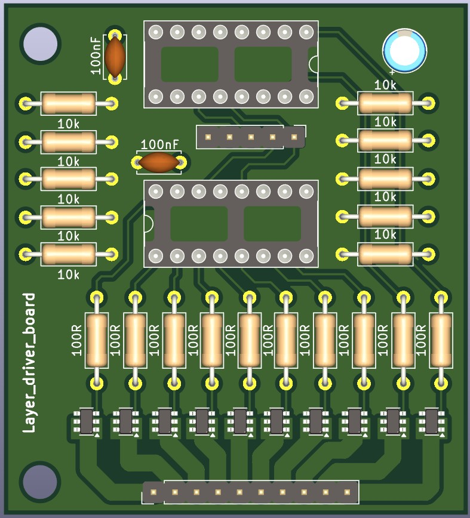{ width=640 height=480 }
  <figcaption>  Capture 3D du PCB</figcaption>
</figure>

---

## Spécifications PCB (JLCPCB Standard)

| Paramètre | Spécification standard |
|-----------|----------------------|
| Largeur piste min | 4 mil (0,1 mm) |
| Espacement min | 4 mil (0,1 mm) |
| Via drill min | 0,2 mm |
| Anneau annulaire | 6–8 mil |
| Silkscreen hauteur | 0,8 mm |
| Matériau | FR4 |

<figure markdown>
  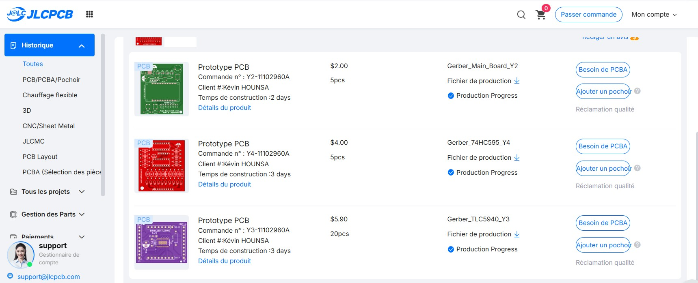{ width=640 height=480 }
  <figcaption> Capture de la plateforme de commande du PCB chez le manufacturier JLCPCB !</figcaption>
</figure>

!!! tip "Condensateurs de découplage"
    Placer les condensateurs **100 nF le plus près possible** de chaque broche VCC des TLC5940. Les condensateurs 10 µF sont à placer sur les lignes d'alimentation principales. Cette mesure est critique pour la stabilité du signal GSCLK.
