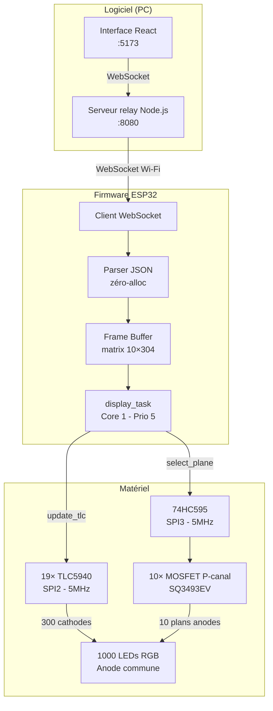
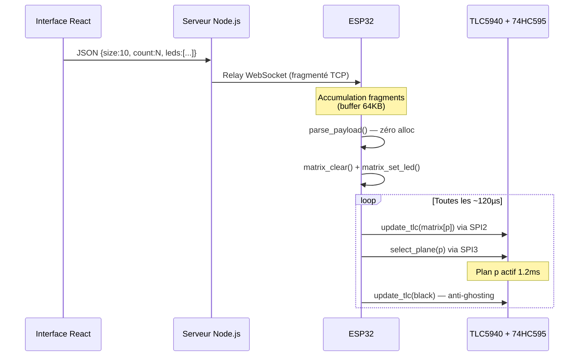

# Vue d'ensemble du système

## Schéma synoptique



---

## Blocs fonctionnels

### Interface Web (PC)

L'interface, développée en **React.js**, tourne dans le navigateur et communique avec le serveur relay via WebSocket. Elle intègre :

- Une **vue 3D WebGL** (Three.js) du cube en temps réel
- Des onglets : Formes, Dessin, Texte, Animations, Script, Import OBJ
- Un **éditeur plan par plan** pour dessiner manuellement des formes
- Un panneau WebSocket pour la connexion et l'envoi des données

### Serveur relay Node.js

Le serveur `server.js` fait le pont entre le navigateur et l'ESP32. Il identifie chaque client par un message `register` et relaie les payloads LED du navigateur vers l'ESP32.

```
Navigateur  →  register {"role":"browser"}  →  Serveur
ESP32       →  register {"role":"esp32"}    →  Serveur
Navigateur  →  payload JSON LEDs            →  Serveur → ESP32
```

### Firmware ESP32

Le firmware ESP-IDF gère deux tâches FreeRTOS :

| Tâche | Core | Priorité | Rôle |
|-------|------|----------|------|
| `app_main` / WebSocket | Core 0 | Normale | Réception et parsing des payloads |
| `display_task` | Core 1 | 5 (haute) | Scan des 10 plans en boucle continue |

Un **mutex** protège le buffer `matrix[][]` contre les accès simultanés des deux tâches.

### Hardware

| Composant | Rôle | Interface |
|-----------|------|-----------|
| 19× TLC5940 | PWM 12 bits sur 300 canaux cathodes | SPI2, 5 MHz |
| 74HC595 | Sélection du plan actif (0-9) | SPI3, 5 MHz |
| 10× MOSFET SQ3493EV | Commutation courant anode commune | GPIO via 74HC595 |
| LEDC ESP32 | Génération GSCLK 1 MHz | GPIO21 |

---

## Flux de données complet


