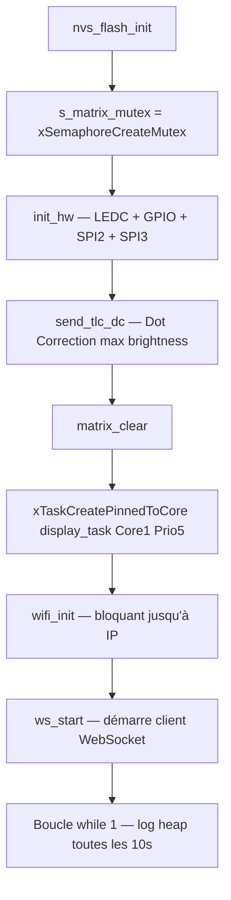

# Structure du Firmware

## Organisation du code

Tout le firmware est concentré dans un **fichier unique `main.c`** pour éviter les problèmes de linkage sous ESP-IDF avec plusieurs unités de compilation.

```
Animation_3D/
├── CMakeLists.txt          ← Projet racine
├── sdkconfig.defaults      ← Configuration ESP-IDF
└── main/
    ├── CMakeLists.txt      ← Composant main (source: main.c uniquement)
    └── main.c              ← Tout le firmware ici
```

## CMakeLists.txt du composant main

```cmake
idf_component_register(
    SRCS "main.c"
    INCLUDE_DIRS "."
    REQUIRES
        esp_wifi esp_event esp_netif nvs_flash
        esp_websocket_client freertos log driver esp_rom
)
```

!!! warning "Pas de cJSON"
    Le composant `json` (cJSON) n'est **pas** requis. Le parsing JSON est fait manuellement pour éviter les problèmes de mémoire heap sur des payloads de 41 KB.

---

## Sections du fichier main.c

```c
/* ═══════ CONFIGURATION ══════════════════════════════ */
#define WIFI_SSID       "..."
#define WIFI_PASSWORD   "..."
#define SERVER_URI      "ws://192.168.x.x:8080"
#define CUBE_SIZE       10
#define TOTAL_LEDS      1000
#define NUM_TLC         19
#define NUM_OUTPUTS     304   // 19 × 16
#define NUM_PLANES      10

/* ═══════ BUFFER HARDWARE ════════════════════════════ */
static uint16_t matrix[NUM_PLANES][NUM_OUTPUTS];
static SemaphoreHandle_t s_matrix_mutex;

/* ═══════ INIT HARDWARE ══════════════════════════════ */
static void init_hw(void)          // LEDC + GPIO + SPI2 + SPI3

/* ═══════ TLC5940 ════════════════════════════════════ */
static void send_tlc_dc(void)      // Dot Correction au démarrage
static void update_tlc(...)        // Envoi grayscale SPI

/* ═══════ 74HC595 ════════════════════════════════════ */
static void select_plane(int p)    // Sélection plan MOSFET

/* ═══════ DISPLAY TASK (Core 1) ══════════════════════ */
static void display_task(void *pv) // Boucle scan 10 plans

/* ═══════ BUFFER MATRIX ══════════════════════════════ */
static void matrix_clear(void)
static void matrix_set_led(int pos, int z, uint16_t r, g, b)

/* ═══════ PARSER JSON ════════════════════════════════ */
static void parse_payload(...)     // Parser zéro-alloc
static bool next_key(...)
static bool read_int_after_colon(...)

/* ═══════ WEBSOCKET ══════════════════════════════════ */
#define ACCUM_SIZE 65536           // Buffer accumulation 64 KB
static void ws_event_handler(...)
static void ws_start(const char *uri)

/* ═══════ WIFI ═══════════════════════════════════════ */
static void wifi_event_handler(...)
static void wifi_init(void)

/* ═══════ APP_MAIN ═══════════════════════════════════ */
void app_main(void)
```

---

## Séquence de démarrage (app_main)



---

## Tâches FreeRTOS

### display_task (Core 1, priorité 5)

```c
void display_task(void *pv) {
    uint16_t plane_buf[NUM_OUTPUTS];
    while (1) {
        for (int p = 0; p < NUM_PLANES; p++) {
            // 1. Copie atomique du plan sous mutex
            xSemaphoreTake(s_matrix_mutex, 1ms);
            memcpy(plane_buf, matrix[p], sizeof(plane_buf));
            xSemaphoreGive(s_matrix_mutex);

            // 2. Envoi TLC + sélection plan
            update_tlc(plane_buf);
            select_plane(p);
            esp_rom_delay_us(1200);

            // 3. Anti-ghosting
            update_tlc(s_black);
            select_plane(11);
        }
    }
}
```

### WebSocket handler (Core 0)

Le handler `ws_event_handler` accumule les fragments TCP puis appelle `parse_payload` qui met à jour `matrix[][]` sous mutex.
