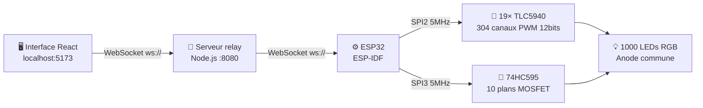

# O'Matrix — Cube LED RGB 10×10×10

  <h2 style="color: #00d4ff; letter-spacing: 3px;">O'MATRIX</h2>
  
<strong>Système d'affichage volumétrique 3D · 1 000 LEDs RGB · ESP32 · TLC5940</strong>

  
<em>EPAC/UAC — Projet en Tutorat 5e Année Génie Électrique — 2024-2025</em>

  
<em>Réalisé par HOUNSA Kévin & YEHOUENOU Chrysostome — Sous la supervision de Dr. KIKI Probus</em>

---

## Présentation du projet

Le projet **O'Matrix** est un cube d'affichage LED RGB tridimensionnel de **10×10×10 voxels** (1 000 LEDs au total), piloté par un microcontrôleur **ESP32** via une interface web interactive développée en **React.js**.

Le système permet de visualiser des formes 3D, animer des jeux de lumière, et interagir en temps réel à distance via **WebSocket sur Wi-Fi**.

---

## Architecture globale

---

## Fonctionnalités principales

| Code | Fonctionnalité | Description |
|------|---------------|-------------|
| F1 | **Affichage 3D** | Formes voxels : sphère, cube, tore, pyramide, hélice, diamant... |
| F2 | **Jeux de lumière** | Vagues, pluie, plasma, spirale galactique, animations dynamiques |
| F3 | **Interface web** | Application React avec vue 3D WebGL, contrôle à distance |
| F4 | **Interactivité 3D** | Rotation, translation, zoom, inspection couche par couche |
| F5 | **Dessin manuel** | Éditeur plan par plan avec gestion de frames d'animation |
| F6 | **Communication** | WebSocket Wi-Fi, serveur relay Node.js |

---

## Spécifications techniques résumées

=== "Matériel"

    | Composant | Valeur |
    |-----------|--------|
    | Microcontrôleur | ESP32-WROOM-32 |
    | Driver LEDs | 19× TLC5940 (304 canaux PWM 12 bits) |
    | Driver plans | 74HC595 + 10× MOSFET P-canal IRF9540 |
    | LEDs | 1 000 RGB à anode commune, 5 mm diffuse |
    | Alimentation | 5 V – 6 A |
    | Résistance Rref | 2 kΩ → Is = 20 mA |

=== "Logiciel"

    | Composant | Technologie |
    |-----------|-------------|
    | Firmware | ESP-IDF v5.4 (C) |
    | Interface | React.js + Three.js + WebSocket |
    | Serveur relay | Node.js + `ws` |
    | IDE | VS Code + ESP-IDF extension |
    | Conception PCB | KiCad |
    | Fabrication PCB | JLCPCB |

=== "Communication"

    | Signal | Fréquence |
    |--------|-----------|
    | SPI TLC5940 | 5 MHz (SPI2_HOST) |
    | SPI 74HC595 | 5 MHz (SPI3_HOST) |
    | GSCLK | 1 MHz (LEDC) |
    | Multiplexage plans | ~833 Hz (10 plans × ~83 µs) |
    | WebSocket payload | ~41 KB / 1000 LEDs JSON |

---

## Navigation dans la documentation

<h3>🏗 Architecture</h3>

Vue d'ensemble du système, description des composants, principe de multiplexage, conception des PCBs.

<a href="architecture/vue-ensemble/">→ Voir l'architecture</a>

<h3>💻 Firmware</h3>

Structure du code ESP-IDF, driver TLC5940, WebSocket, parsing JSON, gestion du buffer et indexation.

<a href="firmware/structure/">→ Voir le firmware</a>

<h3>🖥 Interface Web</h3>

Architecture React, hook WebSocket, serveur relay Node.js, format des payloads.

<a href="interface/architecture/">→ Voir l'interface</a>

<h3>⚠ Problèmes & Solutions</h3>

Tous les problèmes rencontrés durant le projet avec leurs causes et solutions détaillées.

<a href="problemes/signaux/">→ Voir les problèmes</a>

