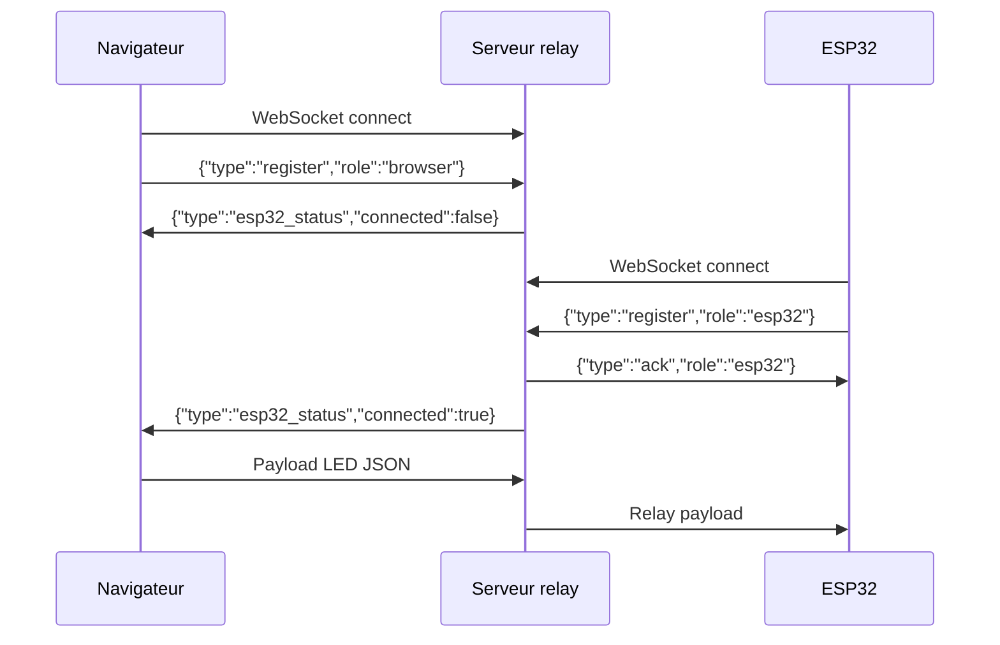

# Serveur Relay Node.js

## Architecture

Le serveur `server.js` fait le pont entre le navigateur et l'ESP32. Il utilise `http.createServer` + `WebSocketServer` attaché au serveur HTTP pour une compatibilité maximale avec `esp_websocket_client`.

```javascript
const httpServer = http.createServer((req, res) => {
    // Health-check : GET / → 200 "LED Cube WebSocket Server OK"
});
const wss = new WebSocketServer({ server: httpServer });
httpServer.listen(8080, '0.0.0.0');
```

!!! warning "Ne pas utiliser WebSocketServer({ port })"
    `new WebSocketServer({ port: 8080 })` crée un serveur TCP interne qui ne gère pas toujours bien le handshake HTTP→WS avec esp_websocket_client. Le pattern `{ server: httpServer }` est obligatoire.

## Protocole d'identification



## Gestion des déconnexions

- Si l'ESP32 se déconnecte → broadcast `{"type":"esp32_status","connected":false}` à tous les navigateurs
- Si aucun ESP32 connecté → les payloads du navigateur sont ignorés avec un warning en console

## Démarrage robuste

```json
// package.json
"start": "npx kill-port 8080 && concurrently \"npm run server\" \"npm run dev\""
```

Le `npx kill-port 8080` évite l'erreur `EADDRINUSE` lors des redémarrages rapides.

## Vérification santé

```bash
curl http://localhost:8080
# Réponse attendue : LED Cube WebSocket Server OK
```

Si cette commande fonctionne, le serveur est opérationnel et le handshake WebSocket fonctionnera.
