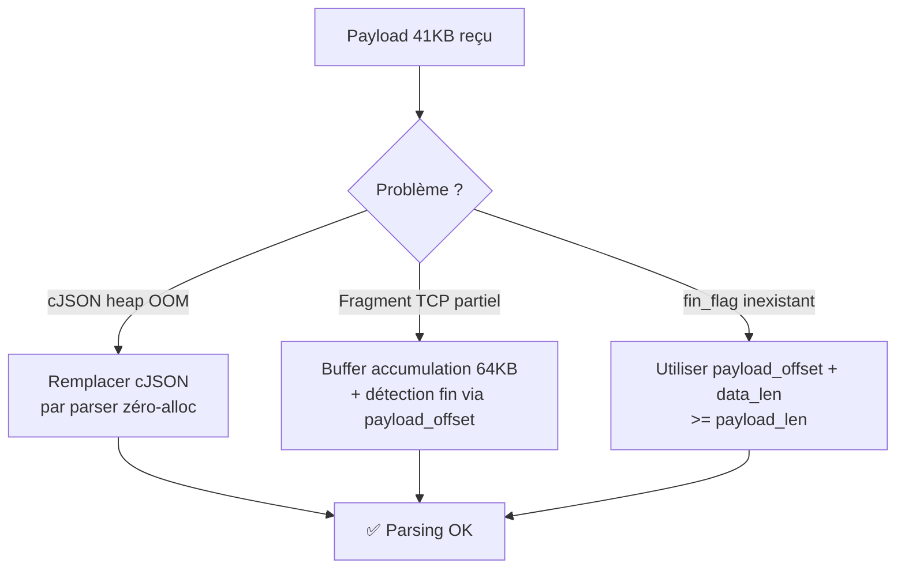

# Fragmentation JSON — Payload trop grand

## Contexte

Un payload de **1 000 LEDs** en JSON représente environ **41 KB** :

```json
{"size":10,"count":1000,"leds":[
  {"pos":0,"z":0,"r":0,"g":4095,"b":4095},
  ...  // × 1000
]}
```

## Problème 1 : JSON parse error avec cJSON

### Symptôme

```
E (666072) LED_CUBE: JSON parse error (len=40933)
E (668652) LED_CUBE: JSON parse error (len=40933)
```

### Cause

La bibliothèque **cJSON** alloue dynamiquement un nœud heap pour chaque valeur JSON. Pour 1 000 LEDs × 5 champs = **5 000 nœuds** → consommation heap estimée à **~200 KB**, supérieure à la RAM disponible (~190 KB libres).

```
Heap disponible : ~190 KB
cJSON nécessite : ~200 KB
             → malloc échoue → cJSON_Parse retourne NULL
```

### Solution appliquée

Remplacement de cJSON par un **parser minimaliste zéro-allocation** qui lit le JSON octet par octet directement dans le buffer d'accumulation :

```c
// AVANT (cJSON — problématique)
cJSON *root = cJSON_Parse(buf);  // ← 200 KB heap !

// APRÈS (parser custom — zéro alloc)
const char *leds_ptr = memmem(buf, len, "\"leds\"", 6);
// Parcours caractère par caractère sans aucun malloc
```

**Résultat** : consommation heap supplémentaire = **0 octet** pendant le parsing.

---

## Problème 2 : Fragmentation TCP des messages WebSocket

### Symptôme

```
E (157167) transport_ws: Error read data
E (157167) transport_ws: Error reading payload data
E (176027) WS_CLIENT: JSON parse error
```

### Cause

Le buffer WebSocket ESP-IDF (`buffer_size`) définit la **taille d'un fragment TCP**, pas la taille totale d'un message. Un message de 41 KB est découpé en ~10 fragments de 4 KB. L'ESP-IDF appelle le handler **pour chaque fragment**, pas pour le message complet.

L'ancien code appelait `parse_payload` sur chaque fragment → JSON incomplet → parse error.

### Solution appliquée

**Buffer d'accumulation** de 64 KB alloué une seule fois au démarrage :

```c
#define ACCUM_SIZE 65536   // 64 KB

static char *s_accum    = NULL;
static int   s_accum_len = 0;

// Dans WEBSOCKET_EVENT_DATA :
if (data->payload_offset == 0) accum_reset();   // Nouveau message
accum_append(data->data_ptr, data->data_len);   // Accumule fragment

// Dernier fragment → parse le message complet
if ((data->payload_offset + data->data_len) >= data->payload_len) {
    parse_payload(s_accum, s_accum_len);
    accum_reset();
}
```

### Erreur ESP-IDF v5.x : fin_flag inexistant

#### Symptôme de compilation

```
error: 'esp_websocket_event_data_t' has no member named 'fin_flag'
```

#### Cause

Le champ `fin_flag` existait dans une ancienne version de l'API. En **ESP-IDF v5.x**, il a été remplacé par les champs `payload_offset` et `payload_len`.

#### Correction

```c
// AVANT (compilait sur anciennes versions)
if (data->fin_flag) { parse_payload(...); }

// APRÈS (ESP-IDF v5.x)
if ((data->payload_offset + data->data_len) >= data->payload_len) {
    parse_payload(...);
}
```

| Champ v5.x | Type | Description |
|-----------|------|-------------|
| `payload_len` | `int` | Taille totale annoncée dans le header WS |
| `payload_offset` | `int` | Offset du fragment courant |
| `data_len` | `int` | Taille de ce fragment |

---

## Récapitulatif des solutions


